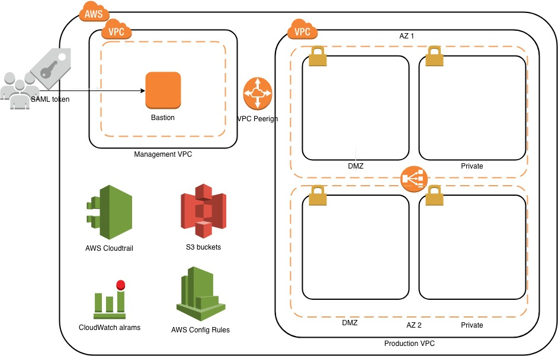

# AWS quickstart-common  
  
This is a modified version of the AWS best practice quick start  
source project: https://github.com/aws-quickstart/quickstart-compliance-nist  
  
## Standardized Architecture for NIST-based Assurance Frameworks on the AWS Cloud  
  
  
The Quick Start will deploy a standard web architecture using multiple VPCs.  
  
  
  
## Architecture notes  
1. All subnets are duplicate on different AZ for high availablity
2. **Managements** subnets should be used only for Security appliances, Logging and Monitoring  
3. **DMZ** Subnets are for web facing services  
4. **Production** subnet is a private network for all services, they can still access the web using the NAT gateway  

### Security groups
Security groups preconfiguration was made to harden security  
Sample Security groups created by the template:  
   
| __SG Name__ | __Purpose__ | __Note__ |
| --- | :---: | ---: |
| from-production | Allow NAT from production | Should be attached for production instances |
| sg-enable-ssh-access | Enable SSH access inside the Production subnet | Should be attached for production instances |
| sg-ssh-access-from-management-vpc | Allow Access to Bastion from anywhere | |
| sg-web-access-ports-from-production | Allow NAT from Management VPC | |
| sg-ssh-access-from-management | Enable Bastion to access production | Should be attached for production instances |
| sg-ssh-access-from-bastion | SG for Bastion Instances | |
| sg-reverse-proxy-dmz-instances | Security group for Reverse Proxy Instances in DMZ | |
| sg-reverse-proxy-dmz | Security group for Reverse Proxy in DMZ | |
| sg-database-access | Port 3306/5432 database for access | Make sure the DB matches your DB |
| sg-app-server-elb-instances | Security group for Appserver Instances | Should be attached for production instances |
| sg-app-server-elb | Security group for Appservers ELB | Should be attached for production instances |

**Important**: Make sure the security group matches your usage intention (ports, inbounds/outbounds, etc)

###  Network ACL
Network ACL preconfiguration was made to harden security 
Please make sure the Inbound and Outbound rules matches your usage 
  
## Pre-Deployment Steps  
* Create the account under the organization  
* Create the SAML and users and roles    
* Ensure that you have manually set up AWS Config in the AWS Config console, if you are deploying into an AWS Region where AWS Config is available. AWS Config is currently available in the regions listed in AWS Regions and Endpoints.  

### On the created AWS account
* Enable Config service
* Create EC2 keys for bastion and default instance group  
* Open a case - Increase number of EIP (to at least 25)  
  
For architectural details, best practices, step-by-step instructions, and customization options, see the   
[deployment guide](https://fwd.aws/n3zr6).  
  
## TBD  
* Automate pre steps  
* Increase number of availability zones  
* Use KIN internal bastion AMI