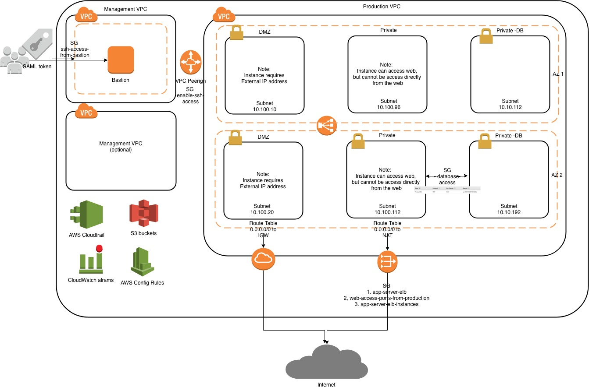

# AWS quickstart-common

This is a modified version of the AWS best practice quick start
source project: https://github.com/aws-quickstart/quickstart-compliance-nist

## Standardized Architecture for NIST-based Assurance Frameworks on the AWS Cloud

The Quick Start will deploy a standard web architecture using multiple VPCs.

## Pre-Deployment Steps
* Create the account under the organization
* Create the SAML and users and roles  
* Ensure that you have manually set up AWS Config in the AWS Config console, if you are deploying into an AWS Region where AWS Config is available. AWS Config is currently available in the regions listed in AWS Regions and Endpoints.
* Create EC2 keys for bastion and default instance group

For architectural details, best practices, step-by-step instructions, and customization options, see the 
[deployment guide](https://fwd.aws/n3zr6).

## TBD
* Automate pre steps
* Dynamic network CIDR
* Increase number of availability zones
* Use internal bastion AMI